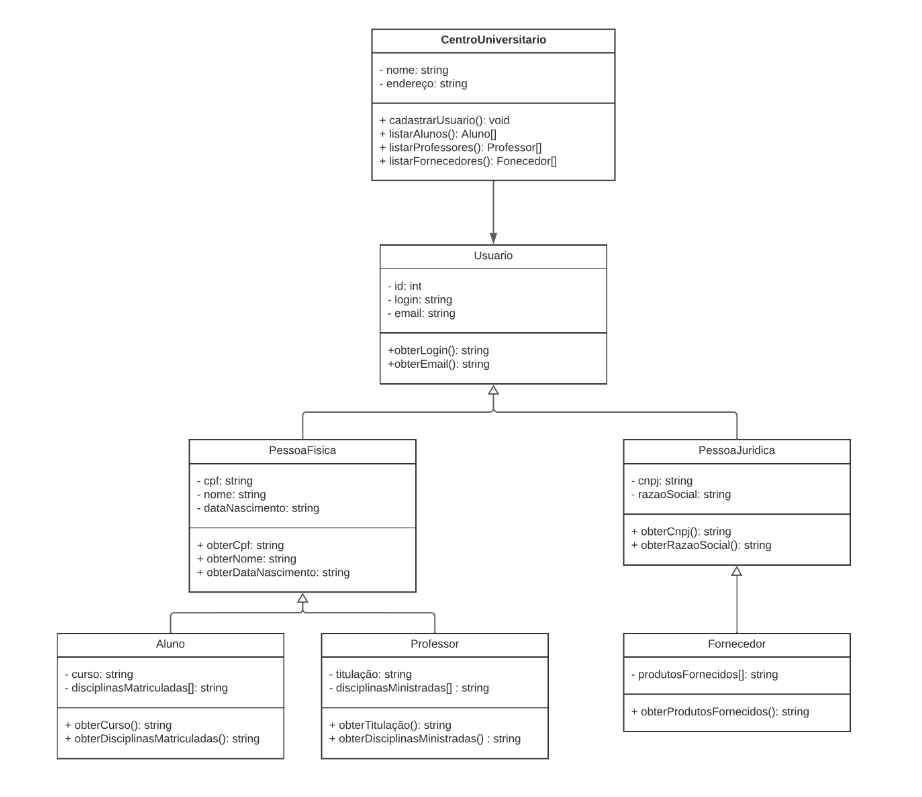
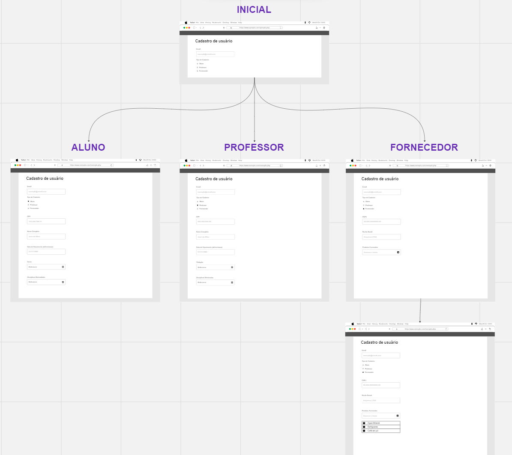
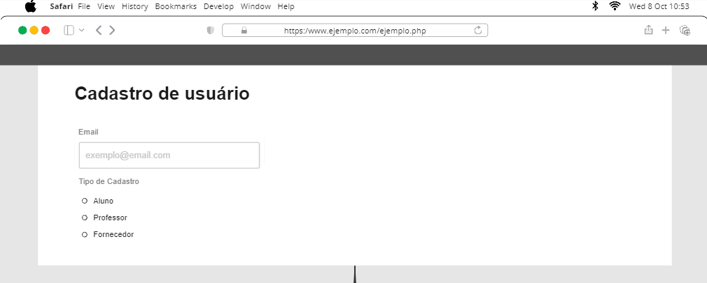
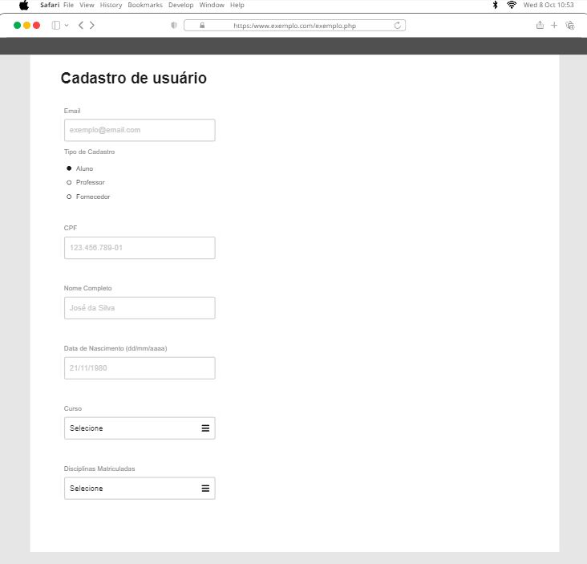
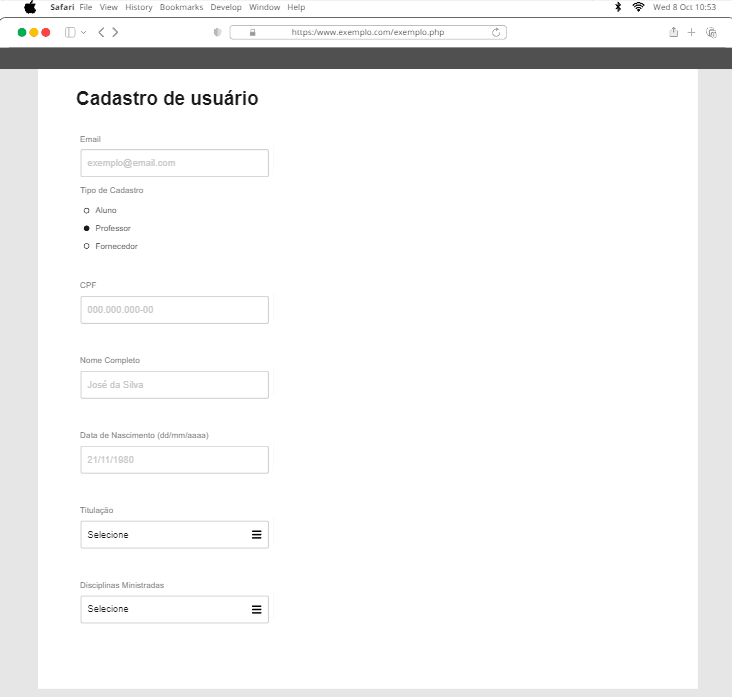
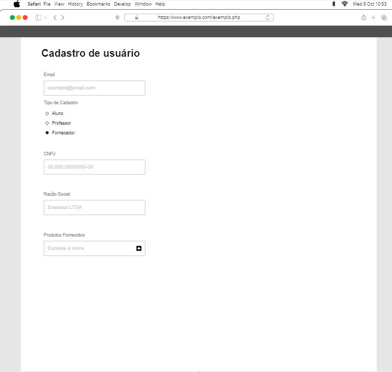
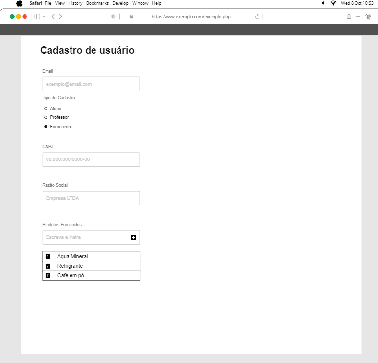

# Projeto Integrador - Desenvolvimento de Sistemas Orientado a Objetos

## Integrantes
- Caroline Machado Martins
- Elias Queiroz Maurício
- Igor Afonso da Silva
- Julia Caroline Mourão de Souza
- Michel de Souza Neres
- Vitor Ramires Carvalho

## Funcionalidade do sistema
- Cadastro de usuários em um sistema universitário
  - Aluno
  - Professor
  - Fornecedor

## Diagrama de caso de uso

## Modelo Entidade Relacionamento

## Prototipação

### Visão geral

### Tela inicial de cadastro do usuário

### Tela de cadastro de aluno

### Tela de cadastro de professor

### Tela de cadastro do fornecedor (parte 1)

### Tela de cadastro do fornecedor (parte 2)

