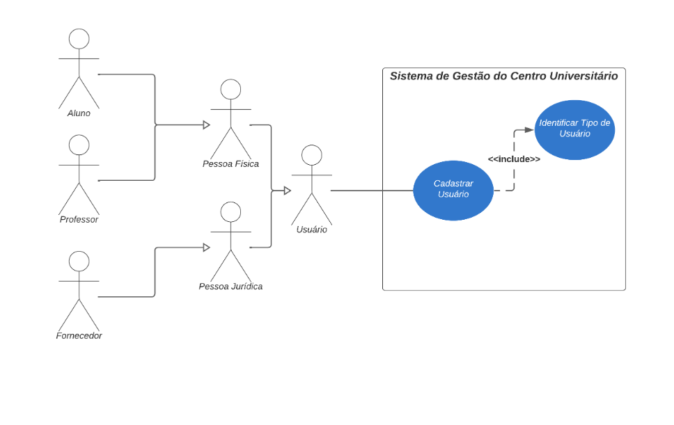

# Projeto Integrador - Desenvolvimento de Sistemas Orientado a Objetos

## Integrantes
- Caroline Machado Martins
- Elias Queiroz Maurício
- Igor Afonso da Silva
- Julia Caroline Mourão de Souza
- Michel de Souza Neres
- Vitor Ramires Carvalho

## Funcionalidade do sistema
- Cadastro de usuários em um sistema universitário
  - Aluno
  - Professor
  - Fornecedor

## Diagrama de caso de uso

